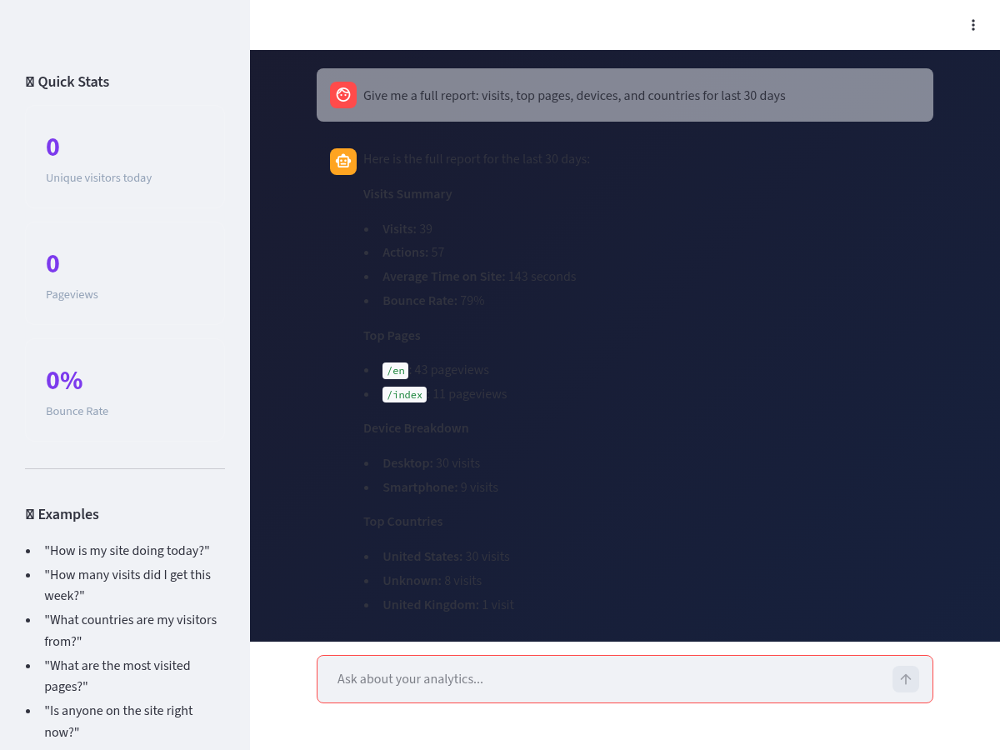

# Matomo MCP — Talk to Your Analytics

[](LICENSE)
[](https://www.python.org/)
[](#testing)

A conversational interface for [Matomo Analytics](https://matomo.org/) using the Model Context Protocol (MCP). Ask about your website performance in natural language — get real answers backed by your own data.



## The Problem

Matomo dashboards are powerful but require context-switching. You have to open the UI, navigate to the right report, set the date range, and interpret the charts. When you just want to know "how is my site doing?" — that's too much friction.

## The Solution

Matomo MCP wraps your Matomo API into conversational tools. Ask questions in plain English, get structured answers from your own analytics data. No third-party services, no data leaving your infrastructure.

```
You: "Give me a full report: visits, top pages, devices, and countries for last 30 days"

Bot: Here is the full report for the last 30 days:

     Visits Summary
     - Visits: 39
     - Bounce Rate: 79%

     Top Pages
     - /en: 43 pageviews
     - /index: 11 pageviews

     Device Breakdown
     - Desktop: 30 visits
     - Smartphone: 9 visits

     Top Countries
     - United States: 30 visits
     - United Kingdom: 1 visit
```

## Quick Start

```bash
# Clone
git clone https://github.com/ronaldmego/matomo-mcp.git
cd matomo-mcp

# Install dependencies
pip install -r requirements.txt

# Configure
cp .env.example .env
# Edit .env with your Matomo URL, API token, and Gemini API key

# Run
streamlit run app.py
```

## Architecture

```
User Query → Streamlit UI → LangChain Agent → Gemini 2.5 Pro
                                    ↓
                            FastMCP Tools → Matomo API (POST)
```

### How It Works

1. User types a question in the Streamlit chat interface
2. LangChain agent (powered by Gemini) interprets the question
3. Agent selects and calls the appropriate MCP tool(s)
4. Tools query your Matomo instance via the Reporting API
5. Agent formats the raw data into a human-readable response

### Project Structure

```
matomo-mcp/
├── server.py          # FastMCP server — 9 Matomo tools
├── app.py             # Streamlit chat UI + LangChain agent
├── test_api.py        # Test suite (18 tests)
├── requirements.txt   # Python dependencies
├── .env.example       # Configuration template
└── assets/            # Screenshots
```

## Tools Available

| Tool | Description |
|------|-------------|
| `get_visits_summary` | Unique visitors, pageviews, bounce rate, avg time |
| `get_top_pages` | Most visited pages with metrics |
| `get_referrers` | Traffic sources breakdown |
| `get_countries` | Visitor geography |
| `get_devices` | Desktop / mobile / tablet split |
| `get_live_visitors` | Real-time visitor count |
| `get_search_keywords` | SEO keywords driving traffic |
| `get_weekly_comparison` | This week vs last week comparison |
| `get_site_info` | Site details from Matomo |

## Tech Stack

| Technology | Why |
|-----------|-----|
| [FastMCP](https://github.com/jlowin/fastmcp) | MCP server framework — turns Python functions into AI-callable tools |
| [Streamlit](https://streamlit.io/) | Rapid chat UI with zero frontend code |
| [LangChain](https://python.langchain.com/) | Agent orchestration — routes questions to the right tool |
| [Gemini 2.5 Pro](https://ai.google.dev/) | Language model for understanding queries and formatting responses |
| [Matomo](https://matomo.org/) | Self-hosted, privacy-respecting web analytics |

## What Makes This Different

| Approach | Data Privacy | Setup | Natural Language | Self-Hosted |
|----------|:----------:|:-----:|:---------------:|:-----------:|
| **Matomo MCP** | Your server only | 5 min | Yes | Yes |
| GA4 + ChatGPT | Google servers | Complex | Partial | No |
| Matomo Dashboard | Your server | N/A | No | Yes |
| Third-party analytics AI | Third-party | Varies | Yes | No |

## Testing

```bash
python test_api.py
```

Runs 18 tests: 7 unit tests (no API calls) + 11 integration tests (live Matomo API).

## Environment Variables

| Variable | Required | Description |
|----------|----------|-------------|
| `MATOMO_URL` | Yes | Your Matomo instance URL |
| `MATOMO_TOKEN` | Yes | API token (Settings → Personal → Security) |
| `GOOGLE_API_KEY` | Yes | Gemini API key |
| `DEFAULT_SITE_ID` | No | Default site ID (default: `1`) |
| `MATOMO_SITES` | No | Site aliases as `name:id,name2:id2` |

See [`.env.example`](.env.example) for a complete template.

## Author

[Ronald Mego](https://ronaldmego.com) — Data & AI

## License

[MIT](LICENSE)
